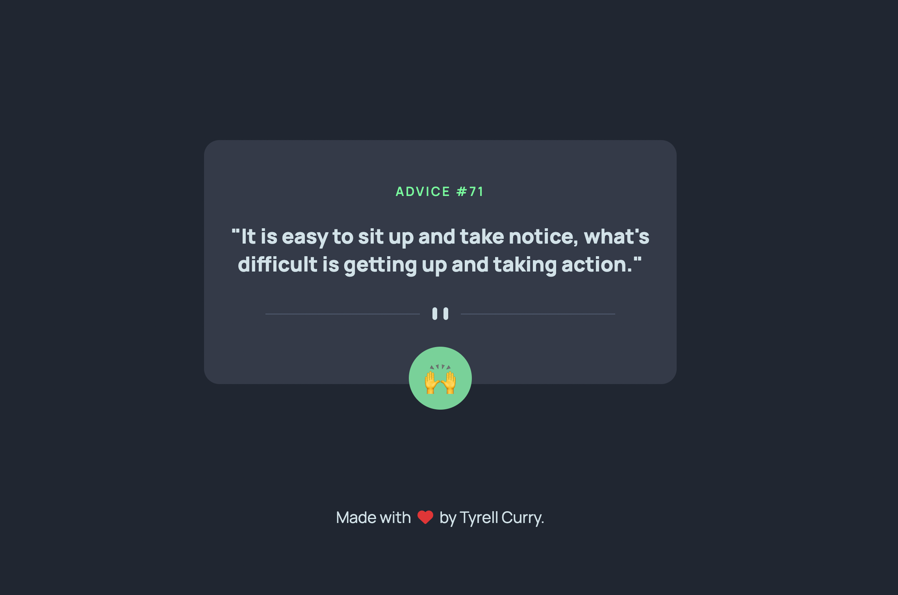
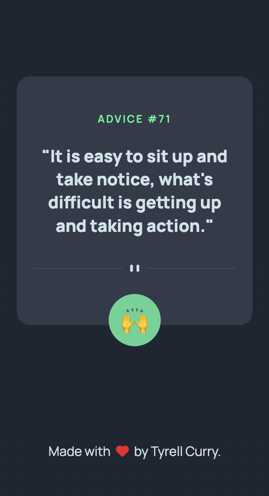

# Advice Generator

## Checkout The Live Project: [HERE!](https://advicegenerator-tyrellcurry.netlify.app/)

## Table Of Contents

- [Overview](#overview)
  - [Project Goals](#project-goals)
  - [Screenshot](#screenshot)
  - [Links](#links)
- [The Process](#the-process)
  - [Built with](#built-with)
  - [What I learned](#what-i-learned)
  - [Useful resources](#useful-resources)
- [Author](#author)

## Overview

### Project Goals

Users should be able to:

- View the optimal layout for the app depending on their device's screen size
- See hover states for all interactive elements on the page
- Generate a new piece of advice by clicking the button

## Screenshots

### Desktop Version



### Mobile Version



### Links

- Live Site URL: [Netlify](https://advicegenerator-tyrellcurry.netlify.app/)

## The Process

### Built with

- HTML5
- SASS
- Vanilla JavaScript
- NPM Packages

### What I learned

In this project I learned about using `fetch`, `async`, and `await` to make an API request and displaying it dynamically on the page using vanilla Javascript.

```js
async function advice() {
  let temp = randomNum;
  randomN();
  if (randomNum === temp) {
    randomN();
  }
  const response = await fetch(
    `https://api.adviceslip.com/advice/${randomNum}`
  );
  const data = await response.json();
  return data;
}
```

### Useful resources

- [Using the Fetch API](https://developer.mozilla.org/en-US/docs/Web/API/Fetch_API/Using_Fetch)

## Author

- Author - [Tyrell Curry](https://tyrellcurry.io)

- Live Site URL: [Netlify](https://advicegenerator-tyrellcurry.netlify.app/)
